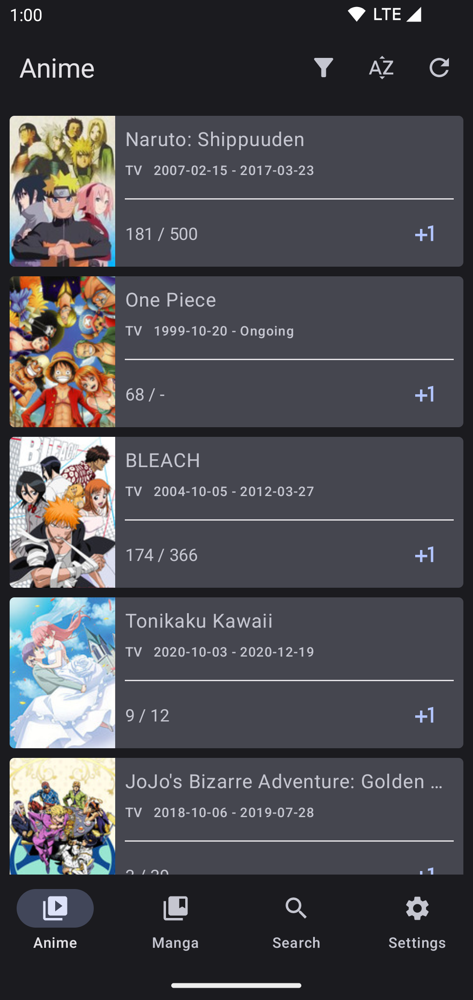
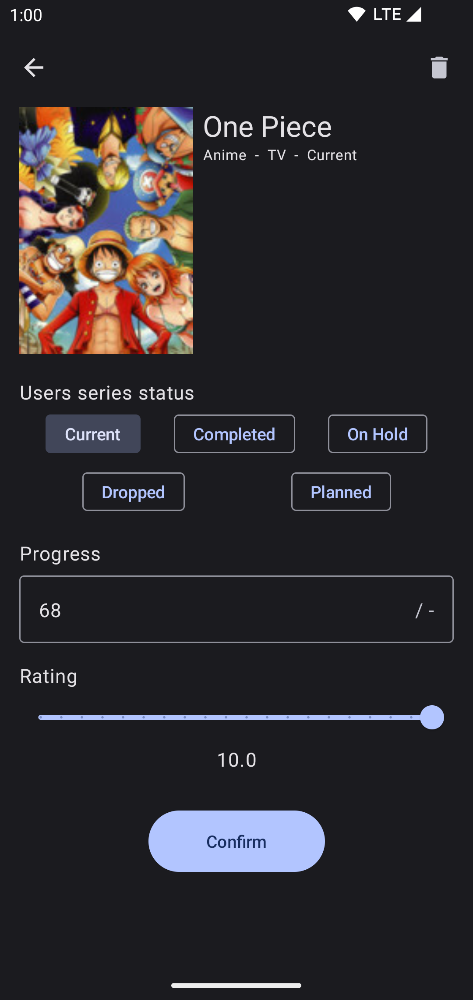

# Nekome

Nekome is an Android application that helps with tracking your anime and manga watch lists. Watch list data is handled by [Kitsu](https://kitsu.io/).

## Features

* Track Anime and Manga series progress
* Quickly update progress on series
* Search for new series to follow
* Light and Dark themes

## Tech Stack

* Support for Android 5.0+ (SDK 21+)
* Fully Kotlin
* Uses [Kitsu](https://kitsu.io/) to store information, all accessed through [their API](https://kitsu.docs.apiary.io/)
* [MVVM](https://developer.android.com/topic/libraries/architecture) for the architecture
* [Compose](https://developer.android.com/jetpack/compose) for the UI layer
* [Material3](https://developer.android.com/jetpack/compose/designsystems/material3) support for dynamic themes using Material 3
* [Hilt](https://dagger.dev/hilt/) for dependency injection
* [Retrofit](https://github.com/square/retrofit) to aid with API communicaton
* [Moshi](https://github.com/square/moshi) for parsing JSON
* [Coroutines](https://github.com/Kotlin/kotlinx.coroutines) to perform async tasks
* [Coil](https://github.com/coil-kt/coil) for async image loading
* [Detekt](https://github.com/arturbosch/detekt) & [ktlint](https://github.com/pinterest/ktlint) are used for static analysis

## Contribution

For contributing to the project, please feel free to [create an issue](https://github.com/Chesire/Nekome/issues/new) or submit a pull request.

## License

    Copyright (C) 2024 Troy Rijkaard

    Licensed under the Apache License, Version 2.0 (the "License"); you may not
    use this file except in compliance with the License. You may obtain a copy of
    the License at

    http://www.apache.org/licenses/LICENSE-2.0

    Unless required by applicable law or agreed to in writing, software
    distributed under the License is distributed on an "AS IS" BASIS, WITHOUT
    WARRANTIES OR CONDITIONS OF ANY KIND, either express or implied. See the
    License for the specific language governing permissions and limitations under
    the License.
